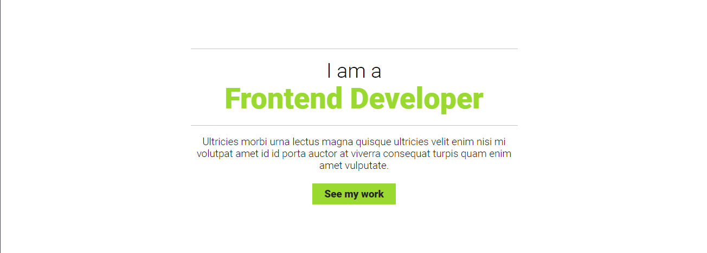

# Project: Personal Portfolio

It is a simple personal portfolio project with a beautiful interface created using HTML and CSS.

## For Live Demo, click <a href="https://app.netlify.com/sites/personal-portfolio-zeeshan/">Here</a>

## Langues:
- HTML
- CSS

## Output:

Happy Coding!
